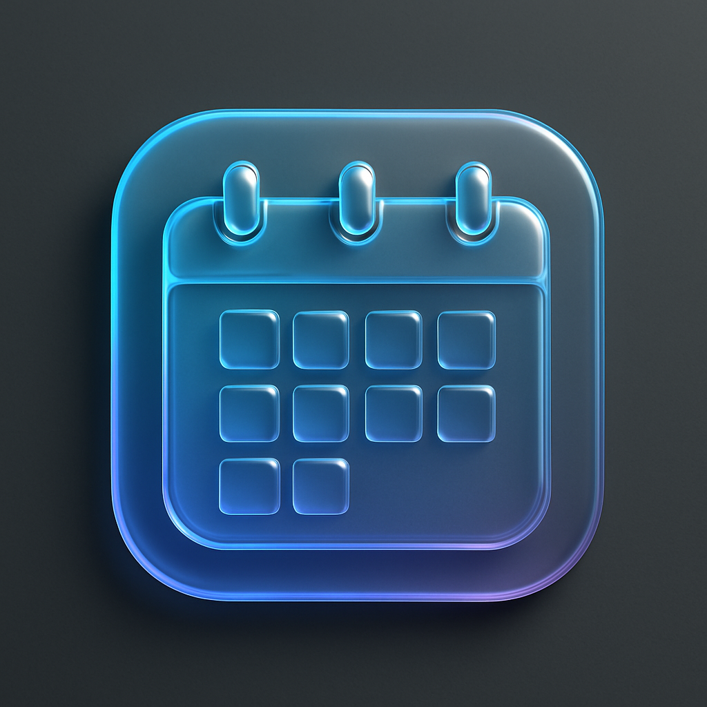

# Android Liquid Glass Calendar

一个美观的Android日历应用，采用Apple的液体玻璃UI设计，支持多语言（简体中文、繁体中文、日语、英语）。

## 特性

- 🎨 **液体玻璃UI设计** - 借鉴Apple最新的Liquid Glass设计语言，提供现代化的半透明界面效果
- 🌍 **多语言支持** - 支持简体中文、繁体中文、日语和英语
- 📅 **完整日历功能** - 月视图、日期选择、事件管理
- ✨ **现代化界面** - 使用Material Design组件和自定义液体玻璃效果
- 🔧 **CI/CD集成** - 使用GitHub Actions进行自动构建和测试

## 截图



## 技术栈

- **开发语言**: Java
- **最低SDK版本**: API 21 (Android 5.0)
- **目标SDK版本**: API 36
- **UI框架**: Android原生 + Material Design
- **构建工具**: Gradle
- **CI/CD**: GitHub Actions

## 项目结构

```
AndroidCalendarApp/
├── app/
│   ├── src/
│   │   ├── main/
│   │   │   ├── java/com/example/androidcalendar/
│   │   │   │   ├── MainActivity.java          # 主活动
│   │   │   │   ├── AddEventActivity.java      # 添加事件活动
│   │   │   │   ├── CalendarEvent.java         # 事件数据模型
│   │   │   │   ├── EventManager.java          # 事件管理器
│   │   │   │   └── EventsAdapter.java         # 事件列表适配器
│   │   │   ├── res/
│   │   │   │   ├── layout/                    # 布局文件
│   │   │   │   ├── values/                    # 默认资源（英语）
│   │   │   │   ├── values-zh-rCN/             # 简体中文资源
│   │   │   │   ├── values-zh-rTW/             # 繁体中文资源
│   │   │   │   ├── values-ja/                 # 日语资源
│   │   │   │   └── drawable/                  # 图形资源
│   │   │   └── AndroidManifest.xml
│   │   └── build.gradle
├── .github/
│   └── workflows/
│       └── android.yml                        # CI/CD配置
├── gradle/
├── build.gradle
├── settings.gradle
└── README.md
```

## 核心功能

### 1. 液体玻璃UI效果
- 半透明卡片视图
- 模糊背景效果
- 动态渐变背景
- 圆角设计元素

### 2. 日历功能
- 月视图显示
- 日期选择和高亮
- 今日标记
- 事件指示器

### 3. 事件管理
- 添加新事件
- 事件列表显示
- 日期时间选择
- 事件详情编辑

### 4. 多语言支持
- 自动检测系统语言
- 支持的语言：
  - 🇺🇸 English
  - 🇨🇳 简体中文
  - 🇹🇼 繁体中文
  - 🇯🇵 日本語

## 构建和运行

### 前提条件
- Android Studio Arctic Fox 或更高版本
- JDK 8 或更高版本
- Android SDK API 36

### 本地构建
1. 克隆仓库：
```bash
git clone https://github.com/chronie-shizutoki/android-liquid-glass-calendar.git
cd android-liquid-glass-calendar
```

2. 在Android Studio中打开项目

3. 同步Gradle文件

4. 运行应用：
```bash
./gradlew assembleDebug
```

### CI/CD
项目使用GitHub Actions进行自动构建：
- 每次推送到main分支时自动触发构建
- 运行单元测试和Lint检查
- 生成APK文件作为构建产物

## 设计理念

### 液体玻璃效果
本应用的UI设计灵感来源于Apple的Liquid Glass设计语言，通过以下技术实现：

1. **半透明效果**: 使用`CardView`配合半透明背景色
2. **模糊背景**: 集成Blurry库实现背景模糊
3. **渐变色彩**: 自定义渐变drawable创建流动感
4. **圆角设计**: 统一的圆角半径营造柔和感

### 色彩方案
- **主色调**: 蓝色系 (#4A90E2)
- **次要色**: 紫色系 (#7B68EE)
- **强调色**: 珊瑚色 (#FF6B6B)
- **背景色**: 半透明白色/黑色

## 依赖库

```gradle
dependencies {
    implementation 'androidx.appcompat:appcompat:1.6.1'
    implementation 'com.google.android.material:material:1.10.0'
    implementation 'androidx.constraintlayout:constraintlayout:2.1.4'
    implementation 'androidx.cardview:cardview:1.0.0'
    implementation 'androidx.recyclerview:recyclerview:1.3.2'
    implementation 'jp.wasabeef:blurry:4.0.1'
}
```

## 贡献

欢迎提交Issue和Pull Request来改进这个项目！

## 许可证

本项目采用MIT许可证 - 查看 [LICENSE](LICENSE) 文件了解详情。

## 致谢

- Apple的Liquid Glass设计语言提供了设计灵感
- Material Design提供了基础UI组件
- Blurry库提供了模糊效果支持

---

**开发者**: Manus AI  
**项目链接**: https://github.com/chronie-shizutoki/android-liquid-glass-calendar

